# Walletwise Database Schema Diagram

## Entity Relationship Diagram (ERD)

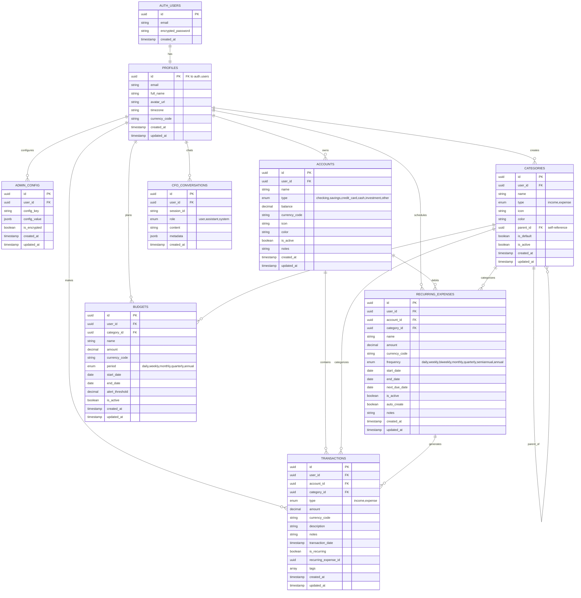

## Database Flow Diagram

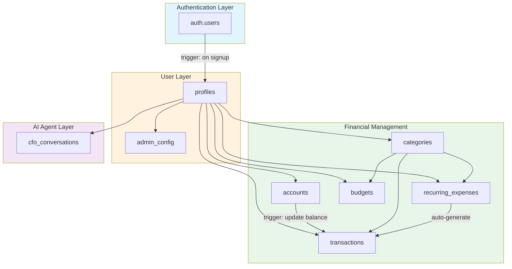

## Data Flow: Transaction Creation

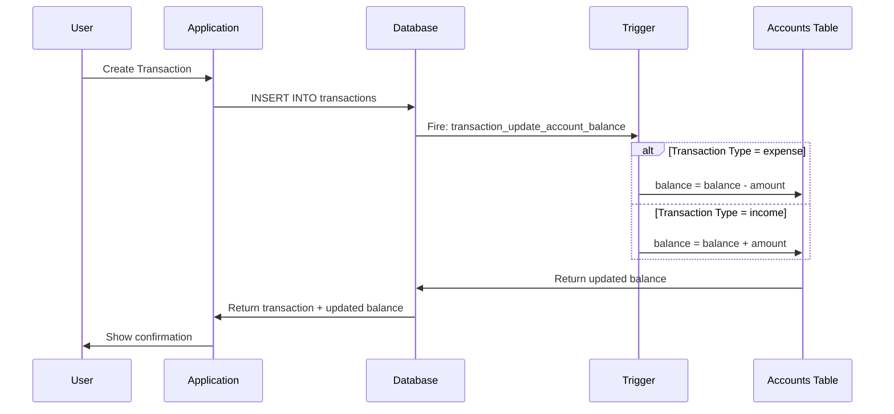

## RLS Policy Flow

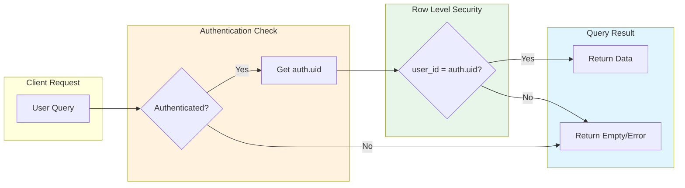

## Recurring Expense Processing

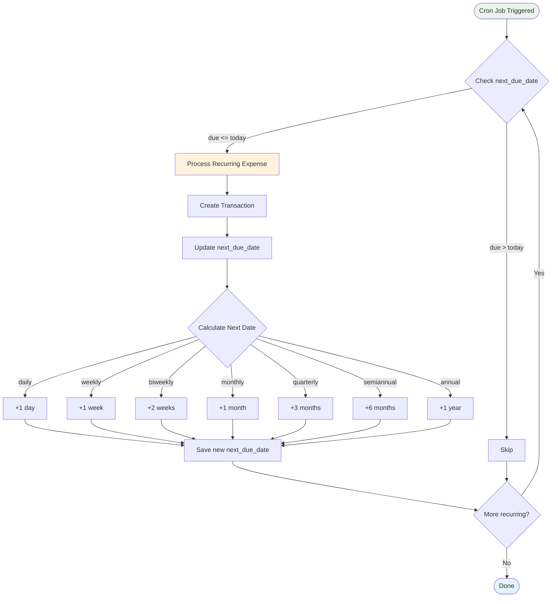

## Budget Progress Calculation

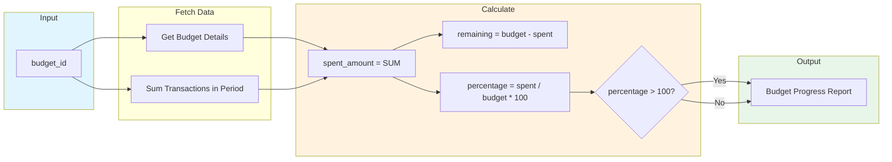

## Index Strategy

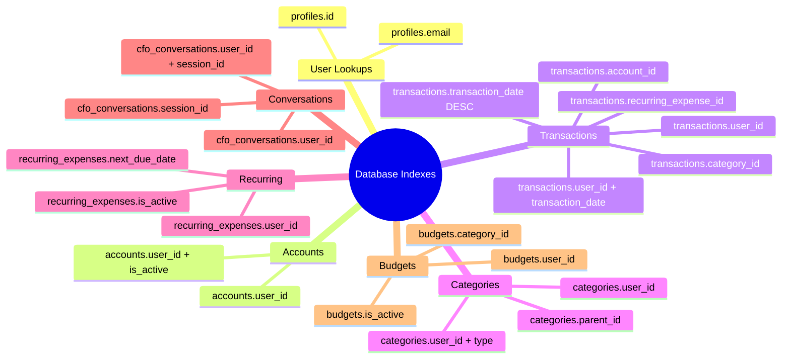

## Security Layers

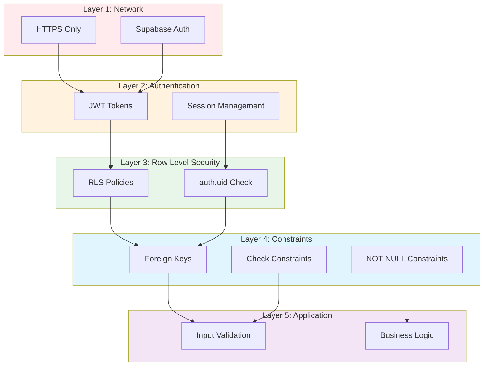

## Function Dependencies

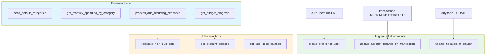

## Category Hierarchy Example

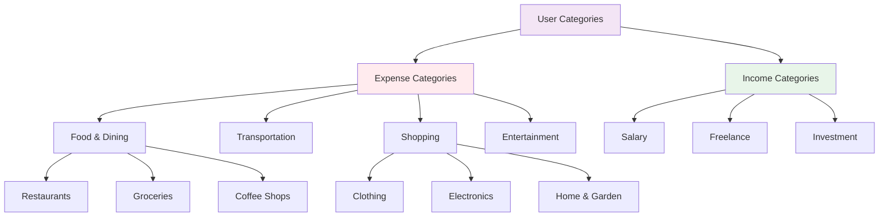

## Transaction Lifecycle

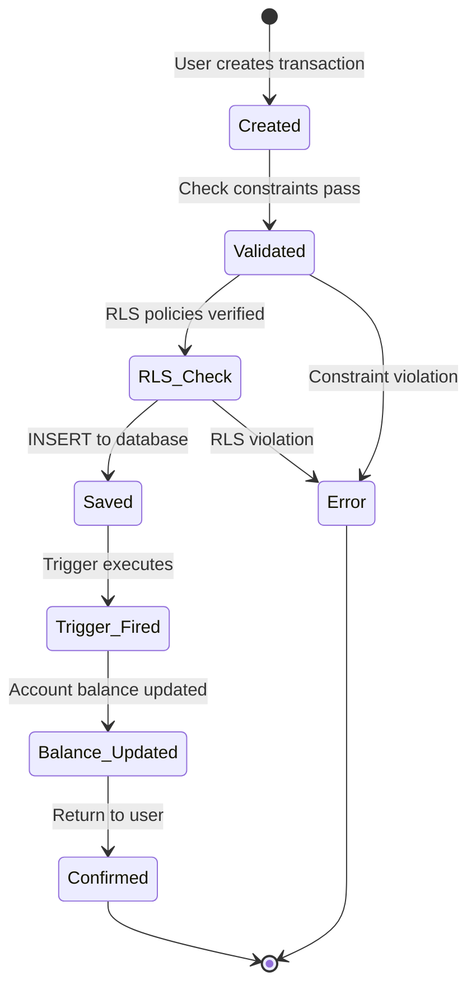

---

## Legend

### Relationship Symbols
- `||--||` : One to One
- `||--o{` : One to Many
- `o{--o{` : Many to Many

### Diagram Types
- **ERD**: Entity Relationship Diagram (structure)
- **Flowchart**: Process flow (logic)
- **Sequence**: Interaction over time
- **Mindmap**: Hierarchical overview
- **State**: Lifecycle states

### Color Coding
- 🔵 **Blue** (#e1f5ff): Authentication/Authorization
- 🟡 **Yellow** (#fff3e0): User/Profile
- 🟢 **Green** (#e8f5e9): Financial/Core
- 🟣 **Purple** (#f3e5f5): AI/Advanced
- 🔴 **Red** (#ffebee): Security/Critical

---

## How to Use These Diagrams

### In Development
- Reference ERD when creating new features
- Follow flow diagrams for business logic
- Check security layers before implementing endpoints

### In Documentation
- Include in technical specs
- Use in onboarding new developers
- Reference in architecture reviews

### In Debugging
- Trace data flow through diagrams
- Verify RLS policy logic
- Check trigger execution order

---

**Note:** These diagrams are generated using Mermaid.js and can be rendered in:
- GitHub README files
- Markdown editors (VS Code, Obsidian, etc.)
- Documentation sites (Docusaurus, VitePress, etc.)
- Mermaid Live Editor (https://mermaid.live)
